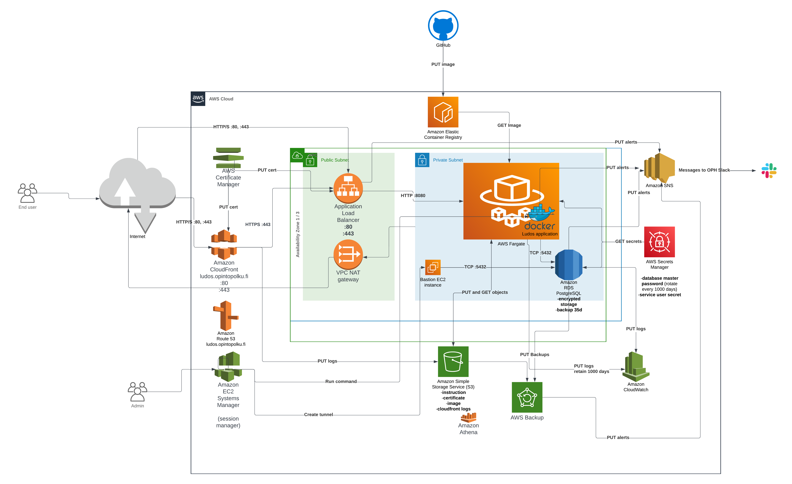

# Ludos
Wiki: https://wiki.eduuni.fi/display/OPHPALV/LUDOS

## Käsitteet

Keskeiset entiteetit, ja järjestelmät, joihin nämä tallennetaan.

| käsite      | selite                                        | tunniste     | tallennuspaikka |
|-------------|-----------------------------------------------|--------------|-----------------|
| Koodisto    | Kooditus objekteille, esim tutkintonimikkeet  | id (tekstiä) | Koodistopalvelu |
| Koodi       | Yksittäisen objektin koodi koodistossa        | id (tekstiä) | Koodistopalvelu |
| Exam        | Koe tyyppi (SUKO / LD / PUHVI)                | -            | -               |
| ContentType | Sisältö tyyppi (koetehtävä / ohje / todistus) |              |                 |
| Assignment  | Koetehtävä                                    |              |                 |
| Instruction | Ohjeet ja tukimateriaalit                     |              |                 |

## Teknologiat

Nämä ovat keskeiset LUDOS-järjestelmässä käytettävät teknologiat. Lista kuvaa järjestelmän nykytilaa ja muuttuu matkan varrella tarpeen mukaan.

- PostgreSQL xx.xx -tietokanta
- Palvelinteknologiat
    - Kotlin (Java 17)
    - Spring boot
    - Flyway-migraatiotyökalu kannan skeeman rakentamiseen ja päivittämiseen kehityksessä ja tuotannossa
    - Gradle buildaa
- Web-sovelluksen frontend-teknologiat
    - npm-työkalu riippuvuuksien hakuun
    - Vite
    - TypeScript
    - React
    - Tailwind
    - Playwright e2e-testaukseen
    - Vitest yksikkötestaukseen
    - React-pdf pdf generointi
    - Tiptap tekstieditori

## Kehitystyökalut

Minimissään tarvitset nämä:
- JDK 17
- Docker PostgreSQL:n
- Node ^20.0.0
- Tarvittaessa tmux `start-local.sh`-skriptiä varten

## AWS-tunnusten konffaus

1) Hanki käyttäjätunnukset OPH:n AWS:ään (oph-aws-sso). Käyttäjätunnuksen tulee kuulua LudosAdmins-ryhmään tai muuten omata AdministratorAccess-policy seuraavilla tileillä:
   * oph-ludos-dev,     accountId = 782034763554
   * oph-ludos-qa,      accountId = 260185049060
   * oph-ludos-prod,    accountId = 072794607950
   * oph-ludos-utility, accountId = 505953557276
2) Asenna AWS CLI ja konffaa tilit siihen tiedostoon ~/.aws/config. Esimerkki:

```
[sso-session oph-federation]
sso_session=oph-federation
sso_region=eu-west-1
sso_start_url = https://oph-aws-sso.awsapps.com/start
sso_registration_scopes = sso:account:access

[profile oph-ludos-dev]
sso_session = oph-federation
sso_account_id = 782034763554
sso_role_name = AdministratorAccess
region = eu-west-1
output = json

[profile oph-ludos-qa]
sso_session = oph-federation
sso_account_id = 260185049060
sso_role_name = AdministratorAccess
region = eu-west-1
output = json

[profile oph-ludos-prod]
sso_session = oph-federation
sso_account_id = 072794607950
sso_role_name = AdministratorAccess
region = eu-west-1
output = json

[profile oph-ludos-utility]
sso_session = oph-federation
sso_account_id = 505953557276
sso_role_name = AdministratorAccess
region = eu-west-1
output = json
```

3) Kirjaudu sisään: `aws --profile oph-ludos-dev sso login` 
4) Testaa: `aws --profile oph-ludos-dev s3 ls` pitäisi listata bucketit


## Ajaminen paikallisesti

### Oikotie kehitysympäristön käyynistykseen
- aja projektin juuressa `./start-local.sh`

### Backend

Käynnistä ensin PostgreSQL tietokanta Dockerissa projektin juuressa: `docker compose up`

Backendiä ajettaessa on valittava sopiva ympäristöprofiili:
- `local` = devaus ja testaus osoitteessa localhost:8000 (vite) tai localhost:8080 (buildattu)
- `untuva` = https://ludos.untuvaopintopolku.fi/ = AWS Fargatessa pyörivä Untuva-LUDOS
- `qa` = https://ludos.testiopintopolku.fi/ = AWS Fargatessa pyörivä QA-LUDOS
- `prod` = https://ludos.opintopolku.fi/ = AWS Fargatessa pyörivä Tuotanto-LUDOS

Salaisuuksien hakeminen:
1) luo `server/.env` ja `playwright/.env`, jossa tarvittavat salaisuudet serverin ajamiseen ja testaamiseen: `aws --profile oph-ludos-dev sso login && aws --profile oph-ludos-utility sso login && scripts/fetch_secrets.sh`

Vaihtoehtoja backendin ajamiseen:
1) Luo Spring Boot run configuration IDEAssa
   
2) Aja `LudosApplication.kt`:n main-metodi IDEAsta. Lisää run configurationiin halutut profiilit, esim. `local` ja lisää working directory `server`
3) `SPRING_PROFILES_ACTIVE=local server/gradlew bootRun -p server bootRun`
4) `yarn build:docker:local` + `yarn run:docker` (profiili kovakoodattu `local`)
5) `cd server && ./gradlew build -x test && LUDOS_PROFILES=local ../docker-build/run.sh`
    * Tää buildaa myös frontendin, joka tarjoillaan osoitteesta https://localhost:8080/ spring
      bootin kautta kuten tuotannossa.
    * 8080-portissa frontti ei kuitenkaan päivity itsestään vaikka `yarn dev:web` ois päällä, vaan on ajettava `yarn build:web` erikseen joka kerta.
    * Fronttia devatessa onkin suositeltavaa ajaa `yarn dev:web` ja käyttää selaimessa porttia `8000` eikä `8080` niin autoreloadid yms toimii

Backend-testit ajetaan esim. komennolla `yarn test:server`.

### Frontend

### Playwright e2e
- run-tests.sh


## Skriptit `/scripts`
- `fetch_secrets.sh` hakee AWS-secrets-managerista backendin tarvitsemat salaisuudet ja tallentaa ne `.env`-tiedostoihin
- `update_backups.sh` kopio lokalisaatio ja koodisto palveluista Ludokseen tarvittavat datat `/server/src/main/resources/backup_data`-kansioon. Skripti ajautuu git on-push hookissa.
- `localizations.ts` komentorivi wrapperi lokalisaatio palvelulle. Käyttohjeet: `yarn localizations`, sekä käyttö esimerkkejä: https://wiki.eduuni.fi/pages/viewpage.action?pageId=380016595

## Riippuvuuksien päivitykset

### Backend

1) `cd server`
2) `./gradlew refreshVersions` lisää saatavilla olevat uudemmat versiot versions.propertiesiin kommentteina
3) Päivitä versiot muokkaamalla versions.properties-tiedostoa
4) `./gradlew clean test --rerun-tasks`

### Frontend

1) `cd web`
2) `yarn upgrade --latest`
   * Jos major-päivitys rikkoi softan etkä ehdi/jaksa korjata, niin reverttaa ja aja ilman `--latest`
3) `cd .. && yarn playwright`

## AWS Infrastructure



## Tekninen dokumentaatio

eduuni-wikissä: https://wiki.eduuni.fi/display/OPHPALV/LUDOS_tekninen+dokumentaatio (vaatii kirjautumisen)

