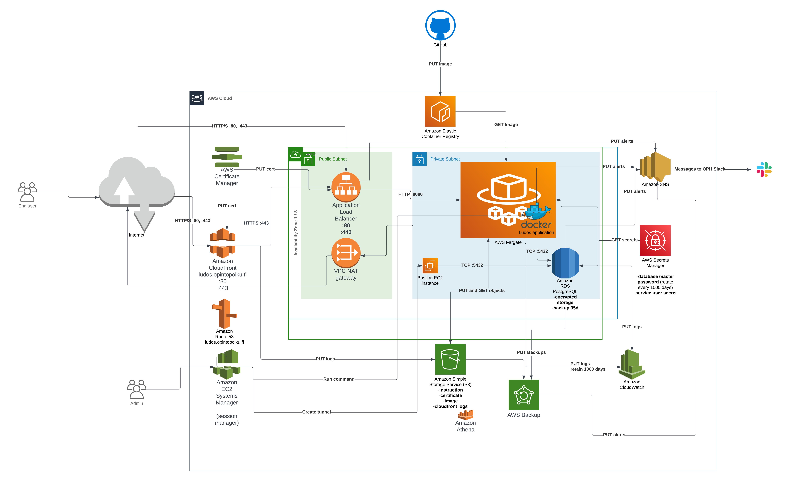

# Ludos

Wiki: https://wiki.eduuni.fi/display/OPHPALV/LUDOS

# Ludos lokaalit linkit

http://localhost:8000/api/test/mocklogin/YLLAPITAJA

## Trivy

https://trivy.util.yleiskayttoiset.opintopolku.fi/muut.html

## Käsitteet

Keskeiset entiteetit, ja järjestelmät, joihin nämä tallennetaan.

| käsite      | selite                                        | tunniste     | tallennuspaikka |
| ----------- | --------------------------------------------- | ------------ | --------------- |
| Koodisto    | Kooditus objekteille, esim tutkintonimikkeet  | id (tekstiä) | Koodistopalvelu |
| Koodi       | Yksittäisen objektin koodi koodistossa        | id (tekstiä) | Koodistopalvelu |
| Exam        | Koe tyyppi (SUKO / LD / PUHVI)                | -            | -               |
| ContentType | Sisältö tyyppi (koetehtävä / ohje / todistus) |              |                 |
| Assignment  | Koetehtävä                                    |              |                 |
| Instruction | Ohjeet ja tukimateriaalit                     |              |                 |

## Teknologiat

Nämä ovat keskeiset LUDOS-järjestelmässä käytettävät teknologiat. Lista kuvaa järjestelmän nykytilaa ja muuttuu matkan varrella tarpeen mukaan.

- PostgreSQL 15.2 -tietokanta
- Palvelinteknologiat
  - Kotlin (Java 25)
  - Spring boot
  - Flyway-migraatiotyökalu kannan skeeman rakentamiseen ja päivittämiseen kehityksessä ja tuotannossa
  - Gradle buildaa
- Web-sovelluksen frontend-teknologiat
  - npm-työkalu riippuvuuksien hakuun
  - Vite
  - TypeScript
  - React
  - Tailwind
  - Playwright e2e-testaukseen
  - Tiptap tekstieditori

## Kehitystyökalut

Minimissään tarvitset nämä:

- JDK 25
- Docker PostgreSQL:n
- Node ^24.0.0 (ks. `.nvmrc`)
- tmux `start-local-env.sh`-skriptiä varten

## AWS-tunnusten konffaus

1. Hanki käyttäjätunnukset OPH:n AWS:ään (oph-aws-sso). Käyttäjätunnuksen tulee kuulua LudosAdmins-ryhmään tai muuten omata AdministratorAccess-policy seuraavilla tileillä:
   - oph-ludos-dev, accountId = 782034763554
   - oph-ludos-qa, accountId = 260185049060
   - oph-ludos-prod, accountId = 072794607950
   - oph-ludos-utility, accountId = 505953557276
2. Asenna AWS CLI ja konffaa tilit siihen tiedostoon ~/.aws/config. Esimerkki:

```
[sso-session oph-federation]
sso_session=oph-federation
sso_region=eu-west-1
sso_start_url = https://oph-aws-sso.awsapps.com/start
sso_registration_scopes = sso:account:access

[profile oph-ludos-dev]
sso_session = oph-federation
sso_account_id = 782034763554
sso_role_name = AdministratorAccess
region = eu-west-1
output = json

[profile oph-ludos-qa]
sso_session = oph-federation
sso_account_id = 260185049060
sso_role_name = AdministratorAccess
region = eu-west-1
output = json

[profile oph-ludos-prod]
sso_session = oph-federation
sso_account_id = 072794607950
sso_role_name = AdministratorAccess
region = eu-west-1
output = json

[profile oph-ludos-utility]
sso_session = oph-federation
sso_account_id = 505953557276
sso_role_name = AdministratorAccess
region = eu-west-1
output = json
```

3. Kirjaudu sisään: `aws --profile oph-ludos-dev sso login`
4. Testaa: `aws --profile oph-ludos-dev s3 ls` pitäisi listata bucketit

## Ajaminen paikallisesti

- Aja projektin juuressa `./start-local-env.sh`

### Ympäristöprofiilit

Ympäristöt ja niitä vastaavat Spring-profiilit:

- `local` = devaus ja testaus osoitteessa localhost:8000 (vite) tai localhost:8080 (buildattu)
- `untuva` = https://ludos.untuvaopintopolku.fi/ = AWS Fargatessa pyörivä Untuva-LUDOS
- `qa` = https://ludos.testiopintopolku.fi/ = AWS Fargatessa pyörivä QA-LUDOS
- `prod` = https://ludos.opintopolku.fi/ = AWS Fargatessa pyörivä Tuotanto-LUDOS

## Skriptit `/scripts`

- `update_backups.sh` kopio lokalisaatio ja koodisto palveluista Ludokseen tarvittavat datat `/server/src/main/resources/backup_data`-kansioon.
- `localizations.ts` komentorivi wrapperi lokalisaatio palvelulle. Käyttohjeet: `scripts/run-localizations.sh`, sekä käyttö esimerkkejä: https://wiki.eduuni.fi/pages/viewpage.action?pageId=380016595

## AWS Infrastructure



## Tekninen dokumentaatio

eduuni-wikissä: https://wiki.eduuni.fi/display/OPHPALV/LUDOS_tekninen+dokumentaatio (vaatii kirjautumisen)
